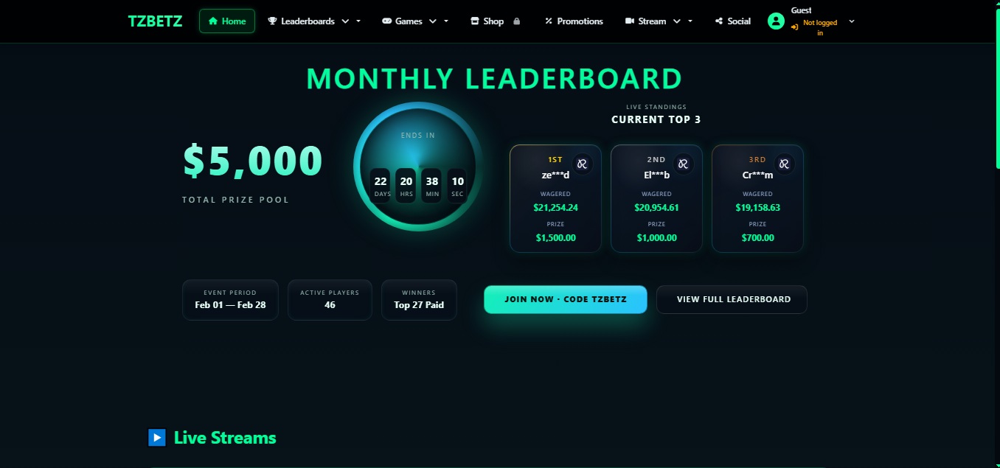
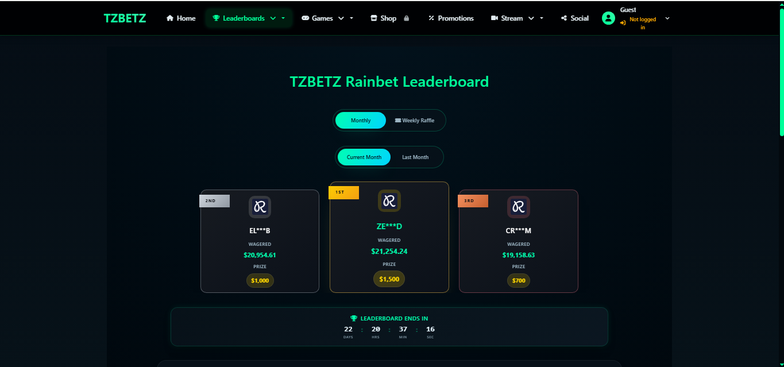

# TZBETZ - Gaming Community Platform (Showcase)

🚀 **Production-ready Leaderboard & Rewards Platform for Casino Streaming Community**

This repository is a public showcase of a real-world system designed for casino streamers, featuring real-time leaderboards, crash games, weekly raffles, and rewards management.

⚠️ **This is a showcase repository only. Source code and backend logic are proprietary and intentionally not included.**

---

## 🌐 Live Website

👉 **Live Site**: [http://tzbetz.com/](http://tzbetz.com/)

⚠️ Access requires Discord or Kick OAuth authentication.

---

## 📌 About This Repository

This repository is **NOT open-source**.

It exists only to:
- Showcase system features and workflows
- Demonstrate real-world usage
- Provide a live demo for evaluation
- Share high-level architecture

🚫 **Source code is not included**  
🚫 **Backend services are private**  
🚫 **Rebuilding or deploying is not permitted**

---

## ✨ Key Features (High-Level)

### Real-time Leaderboards
- Live wager tracking with Rainbet API integration
- Automatic leaderboard updates (20-second polling)
- Monthly prize pools
- Historical leaderboard archives

### Crash Game
- Multiplayer real-time crash game
- WebSocket-based gameplay
- Configurable house edge and max multiplier
- Live betting and auto-cashout
- Game history tracking

### Weekly Raffles
- Automated ticket generation with Fisher-Yates shuffle
- Random ticket distribution based on wagers
- Downloadable prize lists (masked/unmasked)
- Duplicate prevention system

### Points & Rewards System
- Monthly points tracking
- Configurable prize structures
- Automated prize distribution
- Admin-managed prize pools

### OAuth Authentication
- Discord OAuth integration
- Kick OAuth integration
- Secure session management
- Role-based access control

### Admin Dashboard
- Complete prize management
- Raffle ticket generation
- User management
- Leaderboard controls
- Game configuration

### Real-time Features
- WebSocket push notifications
- Live game updates
- Real-time chat system
- Instant leaderboard changes

### User Profile System
- Custom profile images (Sharp image processing)
- User statistics
- Wager history
- Raffle participation tracking

---

## 🏗️ System Architecture (High-Level Overview)

### Frontend
- **Framework**: React 19 with TypeScript
- **Build**: Create React App (CRACO)
- **UI**: Bootstrap 5 + React Bootstrap
- **Real-time**: Socket.io-client
- **Routing**: React Router DOM
- **State**: React Hooks + Context API

### Backend
- **Runtime**: Node.js + Express
- **Database**: MongoDB (Mongoose ORM)
- **Real-time**: WebSocket (ws library)
- **Auth**: Passport.js (Discord, Kick OAuth), JWT
- **Security**: Helmet, CORS, CSP, Rate Limiting
- **Scheduling**: Node-cron (automated tasks)
- **Image**: Sharp (processing)

### Infrastructure
- **Process Manager**: PM2
- **Reverse Proxy**: Nginx
- **Environment**: Multi-env configuration (dev/prod)
- **Session**: MongoDB session store

### External Integrations
- **Rainbet API**: Leaderboard data sync
- **Discord API**: OAuth + user info
- **Kick API**: OAuth + channel info

**Full system design and backend logic are intentionally private.**

---

## 🎮 Notable Features

### Fisher-Yates Shuffle Algorithm
Random ticket distribution for weekly raffles ensuring fair randomization.

### Crash Game Engine
- House edge calculation
- Max multiplier enforcement
- Real-time multiplier growth
- Auto-cashout system
- Fair game verification

### Rate Limiting
MongoDB-based rate limiting for API protection.

### Content Security Policy
Comprehensive CSP headers for XSS protection.

### Automated Cron Jobs
- Rainbet leaderboard sync every 20 seconds
- Monthly points archival
- Weekly raffle finalization

---

## 🖼️ Screenshots

*Screenshots are provided for demonstration purposes only.*
### 📊 Dashboard

### 📊 Leaderboard

- Crash game interface
- Admin panel
- Raffle ticket generation
- User profile

---

## 🔐 License & Usage

**Proprietary Software – All Rights Reserved**

This repository and the showcased system are the intellectual property of **Parikshit Gorain**.

### ❌ You may NOT:
- Copy or reproduce the source code
- Rebuild or redeploy the system
- Create derivative works
- Use commercially or non-commercially without permission

### ✅ You MAY:
- View the live demo
- Review this documentation
- Request authorized usage or collaboration

📩 **For licensing, collaboration, or authorized deployment:**  
Email: [parikshitgorain@yahoo.com](mailto:parikshitgorain@yahoo.com)

---

## 👤 Ownership

**Owner & Maintainer**: Parikshit Gorain  
**Contact**: parikshitgorain@yahoo.com

Unauthorized copying, redistribution, or misuse is strictly prohibited.

---

## 🤖 Building with AI

This system is built and improved using **AI-assisted workflows**, automation, and monitoring tools.

**AI Contribution**: Development process leveraged AI for:
- Code generation and optimization
- API integration patterns
- Security best practices
- Documentation
- Bug fixes and refactoring

All AI-generated code was reviewed, tested, and integrated by the developer.

**Development is ongoing with continuous improvements.**

---

## 💡 Tech Highlights

### Frontend Technologies
- React 19 (TypeScript)
- Bootstrap 5
- Socket.io-client
- React Router DOM
- Axios
- Luxon (date/time)
- React Toastify (notifications)

### Backend Technologies
- Express.js
- MongoDB + Mongoose
- Passport.js (OAuth)
- JWT + bcryptjs
- WebSocket (ws)
- Node-cron
- Sharp (image processing)
- Express Rate Limit

### Security Features
- OAuth 2.0 authentication
- JWT session management
- bcrypt password hashing
- Helmet security headers
- CORS configuration
- CSP (Content Security Policy)
- Rate limiting (MongoDB store)

### Real-time Features
- WebSocket server for crash game
- Push notifications
- Live leaderboard updates
- Chat system

---

## 📊 System Stats

- **Users**: Active casino streaming community
- **Games**: Real-time crash game with concurrent players
- **Raffles**: Weekly automated prize distribution
- **Uptime**: Production-ready with PM2
- **Security**: OAuth, JWT, rate limiting, CSP

---

## 🌟 About This Project

This platform was built by **Parikshit Gorain** as a custom solution for a casino streaming community client.

**Key Development Challenges Solved:**
1. **Real-time Synchronization**: Implemented WebSocket-based crash game with concurrent players
2. **Rainbet API Integration**: Built compliant leaderboard sync with automated 20-second polling
3. **Fair Raffle System**: Developed Fisher-Yates shuffle algorithm for transparent ticket distribution
4. **OAuth Implementation**: Integrated Discord and Kick authentication with secure session management
5. **Performance**: Optimized for production with PM2, Nginx, and MongoDB session store

This project demonstrates full-stack development capabilities with real-time features, external API integration, and production-ready deployment.

---

## ⚠️ Responsible Gambling

This platform promotes **responsible gambling practices**. Users should always:
- Gamble within their means
- Never chase losses
- Seek help if gambling becomes problematic

**Resources**:
- [National Council on Problem Gambling](https://www.ncpgambling.org/)
- [Gamblers Anonymous](https://www.gamblersanonymous.org/)

---

## 📞 Developer Contact

**Live Demo**: [http://tzbetz.com/](http://tzbetz.com/)

**Contact**:
- **Email**: parikshitgorain@yahoo.com

---

## 📄 License

**Proprietary License** - All rights reserved.

See contact information above for licensing inquiries.

---

**Built with ❤️ by Parikshit Gorain with AI assistance**

*Last Updated: February 2026*
